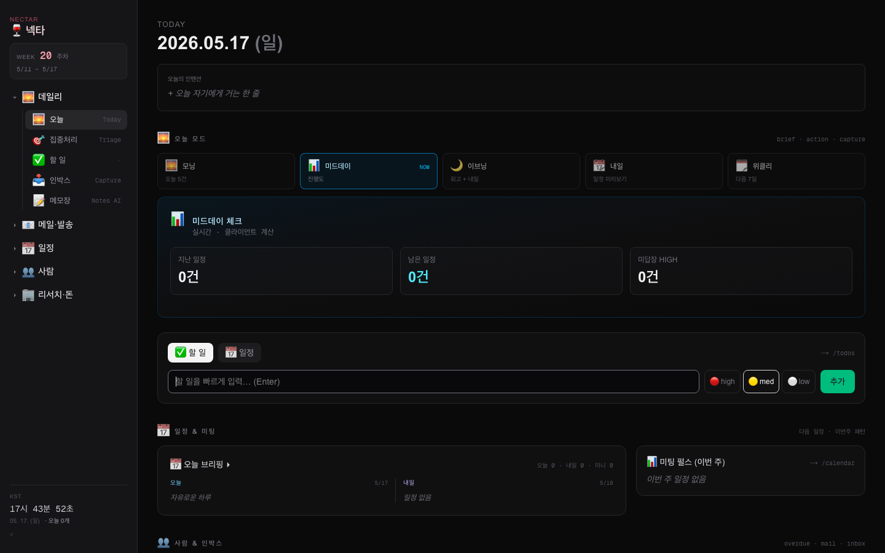
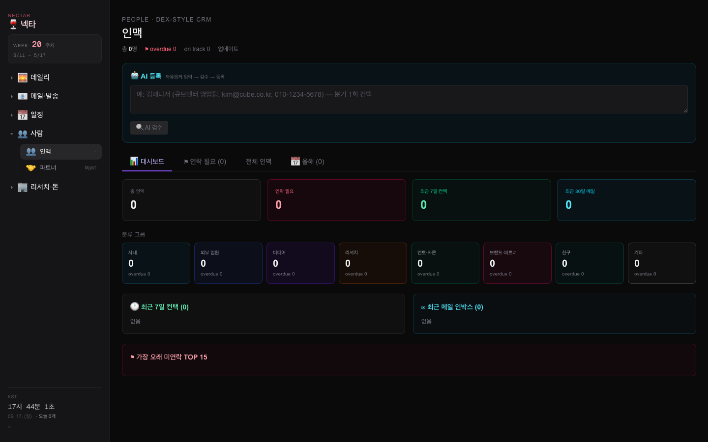
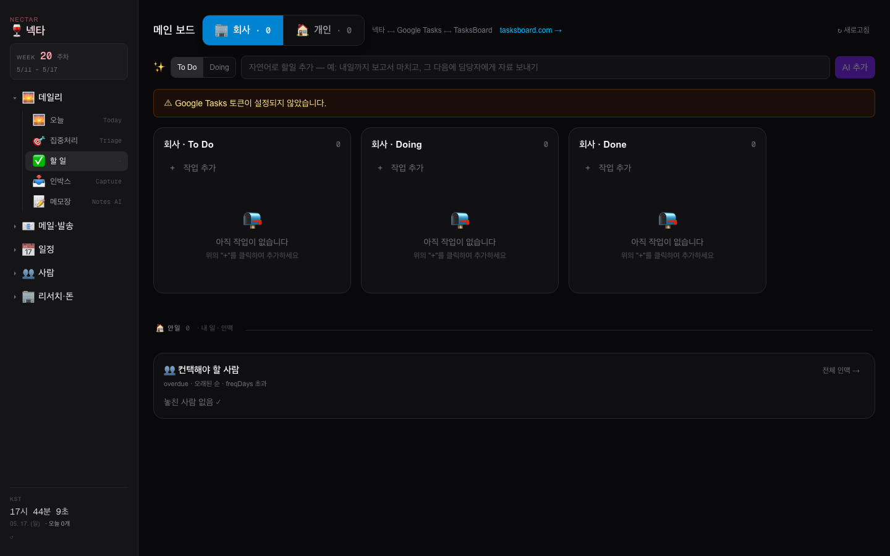
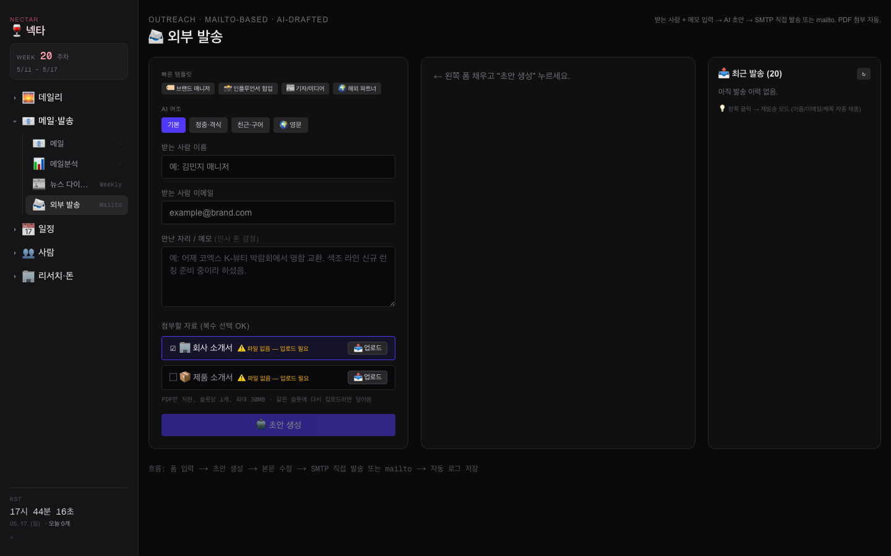
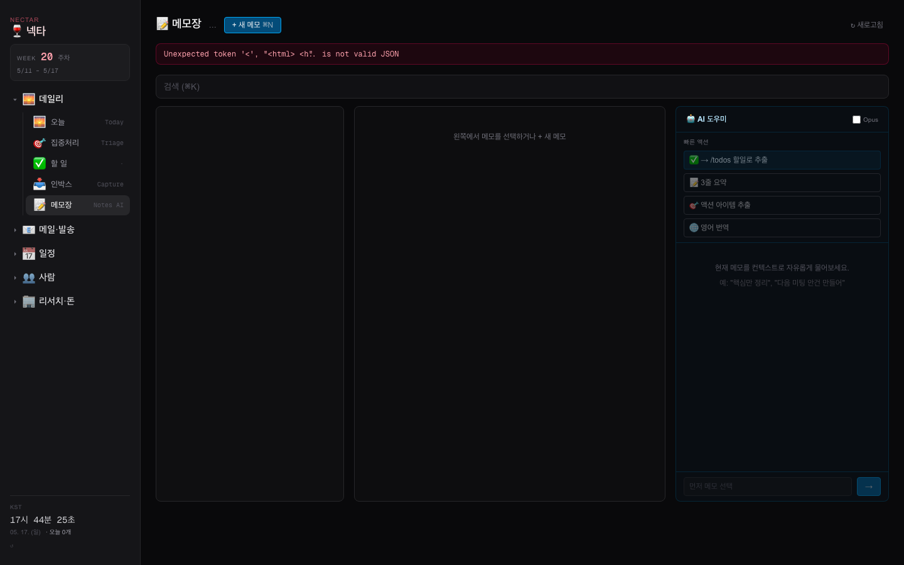

# 🍷 NECTAR-OS

> A minimal personal operating OS for executives — forked from a private dashboard, fully de-personalized into a clean shell. Drop in your own data and credentials.

[](LICENSE)
[](https://nextjs.org)
[](https://react.dev)
[](https://tailwindcss.com)
[](https://claude.com)



---

## ✨ What is this?

A single-tenant operating dashboard for someone running a company. Not a SaaS — you fork it, drop it on a VPS, plug in your credentials, and it becomes your personal command center. All data is yours, all keys are yours, no third-party telemetry.

**Forked from** a private executive dashboard. **De-personalized** — every name, company, contact, and API key from the original has been removed. What's left is a clean shell with the architecture and modules intact.

## 🧩 Modules

| URL | Purpose |
|---|---|
| `/` | Home — day brief, today's events, overdue people, mail digest, money |
| `/todos` | Dual-board (work/personal) + Google Tasks sync |
| `/people` | Personal CRM with overdue tracking |
| `/partners` | Partnership board with auto-ingest from email |
| `/calendar` | Google Calendar unified view |
| `/mail` | IMAP mail with AI categorization & summaries |
| `/money` | Card-charge parsing from Gmail + AI analysis |
| `/memo` | Notes (SQLite) with AI classification & semantic search |
| `/outreach` | Outbound email with auto-attached PDFs + AI draft |
| `/inbox` | Quick-capture inbox (web + optional Telegram) |
| `/weekly` `/monthly` | Reflection prompts + KPI tracking |

<details>
<summary>📸 More screenshots</summary>

| | |
|---|---|
|  |  |
|  |  |

</details>

## 🛠 Stack

- **Next.js 16** (App Router, RSC) · **React 19** · **TypeScript**
- **Tailwind 4** (dark theme, zinc-950 base)
- **SQLite** for memo store · JSON files for the rest
- **Anthropic SDK** (Claude Sonnet 4.6 / Opus 4.7) for AI features
- **pm2** + **nginx** for production
- **Python** scripts for cron jobs (calendar/mail fetch, brief generation)

## 🚀 Quick start

```bash
git clone https://github.com/beauskorea/nectar-os.git
cd nectar-os
npm install
cp .env.example .env.local
# Edit .env.local — at minimum add ANTHROPIC_API_KEY for AI features
npm run build
PORT=3742 npm start
# → http://localhost:3742
```

For production behind nginx + pm2:
```bash
pm2 start npm --name nectar-os -- start
pm2 save && pm2 startup
# Then proxy nginx :80 → :3742
```

## 🗝 Required credentials (all yours)

| Feature | Credential |
|---|---|
| AI signals, mail analysis, briefs | `ANTHROPIC_API_KEY` |
| Email draft generation | `OPENAI_API_KEY` (optional) |
| Calendar / Tasks / Gmail | Google OAuth2 client + `GMAIL_REFRESH_TOKEN` |
| Sending email | SMTP credentials (Gmail App Password works great) |
| Mobile quick-capture | `TELEGRAM_BOT_TOKEN` + `TELEGRAM_CHAT_ID` (optional) |

See [`docs/nectar-os-setup-guide.pptx`](docs/nectar-os-setup-guide.pptx) for a detailed walkthrough (20 slides, Korean).

## 📁 What's NOT in this repo

- Any actual data — all JSON seeds are empty stubs
- Any secret — `.env.local` is gitignored
- The cron scripts use placeholder paths — wire your own credentials in `scripts/`

## 🤝 Contributing

This is a personal-OS template, not a product. Fork freely, but issues/PRs are not actively monitored. If you build something cool from it, let us know.

## 📄 License

MIT — see [LICENSE](LICENSE).

---

<sub>NECTAR-OS · forked & de-personalized · 2026-05-17</sub>
